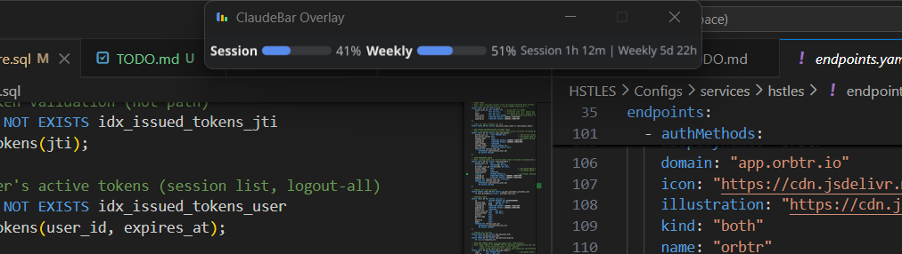

<p align="center">
  
</p>

<h1 align="center">ClaudeBar</h1>

<p align="center">
  A desktop system tray app that monitors your <a href="https://claude.ai">Claude AI</a> usage limits in real-time with a floating always-on-top overlay.
</p>

<p align="center">
  
  
  
</p>

<p align="center">
  
</p>

Built with Go and [Fyne](https://fyne.io/) for cross-platform support. Primary target is Windows, with Linux and macOS stubs in place.

## Features

- **Floating Overlay** - Semi-transparent, always-on-top usage display that stays visible over other apps
- **System Tray** - Quick access to usage stats, settings, and controls from the taskbar
- **Adaptive Layout** - Vertical layout when snapped to sides, horizontal when snapped to top
- **Snap-to-Edge** - Global hotkeys snap the overlay to screen edges and corners
- **Idle Detection** - Reduces API polling when you're away from the keyboard
- **Error Handling** - Automatic retry with exponential backoff, clear error messages on the overlay
- **Session Key Auth** - Paste your session key from browser DevTools (auto-detect from browser cookies is experimental)

## Hotkeys

| Shortcut | Action |
|----------|--------|
| `Ctrl+Alt+Left` | Snap to left edge (vertical layout) |
| `Ctrl+Alt+Right` | Snap to right edge (vertical layout) |
| `Ctrl+Alt+Up` | Snap to top center (horizontal layout) |
| `Ctrl+Alt+Shift+Left` | Snap to top-left corner |
| `Ctrl+Alt+Shift+Right` | Snap to top-right corner |
| `Ctrl+Alt+Shift+Down+Left` | Snap to bottom-left corner |
| `Ctrl+Alt+Shift+Down+Right` | Snap to bottom-right corner |
| `Ctrl+Alt+.` | Open settings window |

## Usage Metrics

- **5-Hour Session** - Rolling session usage with reset countdown
- **Weekly Usage** - 7-day total across all models
- **Reset Timers** - Countdown to next session and weekly reset

## Getting Started

### Prerequisites

1. **Go 1.21+** - [Download Go](https://go.dev/dl/)
2. **GCC/MinGW** - Required for CGO (SQLite dependency)
   - Install via [MSYS2](https://www.msys2.org/): `pacman -S mingw-w64-x86_64-gcc`
   - Or use [TDM-GCC](https://jmeubank.github.io/tdm-gcc/)
3. **Git** - For fetching dependencies

### Build

```bash
cd claudebar

# Download dependencies
go mod tidy

# Build (GUI mode, no console window)
go build -ldflags="-H windowsgui" -o build/windows/claudebar.exe .

# Build with console for debugging
go build -o build/windows/claudebar-debug.exe .
```

### Setup

1. Run `claudebar.exe`
2. The overlay appears at the top center of your screen showing "Set session key in Settings"
3. Open settings with `Ctrl+Alt+.` or right-click the system tray icon
4. Paste your Claude session key:
   - Open [claude.ai](https://claude.ai) in Chrome
   - Press `F12` > Application > Cookies > `claude.ai`
   - Copy the `sessionKey` value (starts with `sk-ant-sid01-` or `sk-ant-sid02-`)
5. The overlay will fetch and display your usage data

## Configuration

Config is stored at `%APPDATA%\ClaudeBar\config.json`:

```json
{
  "session_key": "",
  "organization_id": "",
  "refresh_interval": 60,
  "overlay_enabled": true,
  "overlay_opacity": 0.85,
  "overlay_position": "top",
  "visible_stats": {
    "session_usage": true,
    "daily_usage": true,
    "weekly_usage": true,
    "reset_time": true
  },
  "auto_start": false
}
```

## Architecture

```
claudebar/
├── main.go                     # Entry point
├── internal/
│   ├── app/app.go              # Application orchestration & refresh loop
│   ├── api/
│   │   ├── client.go           # Claude API client (TLS fingerprint, retry, error handling)
│   │   ├── models.go           # Usage data models
│   │   └── auth.go             # Authentication manager
│   ├── browser/
│   │   ├── cookies.go          # Cookie extraction (shared)
│   │   ├── cookies_windows.go  # Windows DPAPI decryption
│   │   ├── cookies_linux.go    # Linux keyring (stub)
│   │   └── cookies_darwin.go   # macOS keychain (stub)
│   ├── ui/
│   │   ├── overlay.go          # Floating overlay window
│   │   ├── widgets.go          # Custom progress bars & usage rows
│   │   ├── tray.go             # System tray menu
│   │   └── settings.go         # Settings dialog
│   ├── config/config.go        # JSON configuration persistence
│   ├── hotkeys/hotkeys.go      # Global hotkey manager
│   └── platform/
│       ├── platform.go         # Platform interface
│       ├── windows.go          # Windows API (transparency, always-on-top, hotkeys)
│       ├── linux.go            # Linux via xdotool/wmctrl
│       └── darwin.go           # macOS via AppleScript (stubs)
├── assets/icons/               # App and tray icons
└── winres/                     # Windows exe icon embedding
```

## Technical Details

### API Integration

ClaudeBar calls Claude's internal web API endpoints:

| Endpoint | Purpose |
|----------|---------|
| `GET /api/organizations` | Discover organization ID |
| `GET /api/organizations/{orgId}/usage` | Fetch usage metrics |

Authentication is via the `sessionKey` cookie, the same one your browser uses.

### Cloudflare Bypass

Claude.ai is behind Cloudflare's bot protection. Standard HTTP clients get 403 errors. ClaudeBar uses [tls-client](https://github.com/bogdanfinn/tls-client) to spoof a Chrome 131 TLS fingerprint, which passes Cloudflare's challenge.

### Windows Platform Features

Since Fyne doesn't natively support transparency or always-on-top windows, ClaudeBar uses Windows API calls via `user32.dll`:

- `SetWindowPos` with `HWND_TOPMOST` for always-on-top
- `SetLayeredWindowAttributes` with `LWA_ALPHA` for transparency
- `RegisterHotKey` for global keyboard shortcuts
- `GetLastInputInfo` for idle detection
- `GetWindowRect` / `MoveWindow` for accurate window positioning

### Error Handling

- Automatic retry on transient network errors (1 retry with 2s delay)
- Exponential backoff on rate limiting (30s, 60s, 120s, 240s)
- Specific detection of expired session keys (`account_session_invalid`)
- Overlay shows error status messages (auth failures, rate limits, connection errors)
- Consecutive failure threshold (3) before showing transient errors to avoid flicker

## Roadmap

See [TODO.md](TODO.md) for planned improvements including:

- Linux and macOS platform support
- OAuth authentication flow
- Auto-start on login
- High usage notifications
- Model-specific usage breakdowns (Opus/Sonnet)

## Dependencies

| Package | Purpose |
|---------|---------|
| [fyne.io/fyne/v2](https://fyne.io/) | Cross-platform GUI toolkit |
| [github.com/bogdanfinn/tls-client](https://github.com/bogdanfinn/tls-client) | TLS fingerprint spoofing for Cloudflare bypass |
| [github.com/mattn/go-sqlite3](https://github.com/mattn/go-sqlite3) | SQLite for reading browser cookies |

## License

MIT - see [LICENSE](LICENSE)

## Credits

Inspired by:
- [Claude-Usage-Tracker](https://github.com/hamed-elfayome/Claude-Usage-Tracker)
- [Win-CodexBar](https://github.com/Finesssee/Win-CodexBar)
